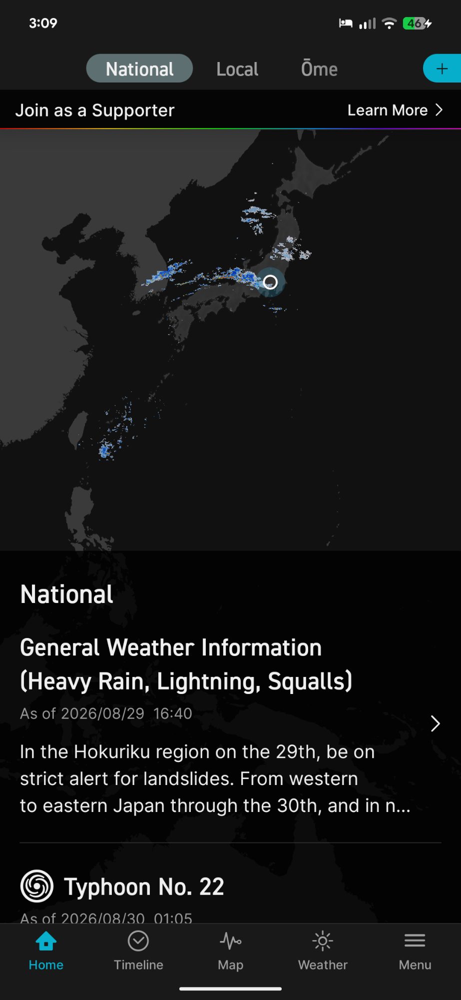
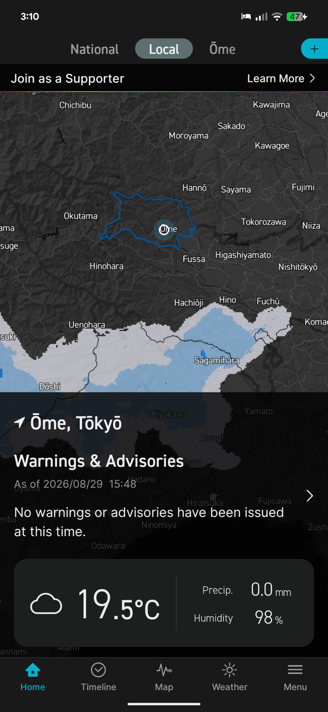
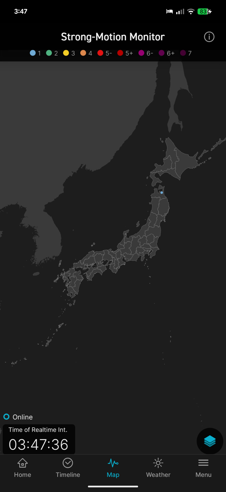
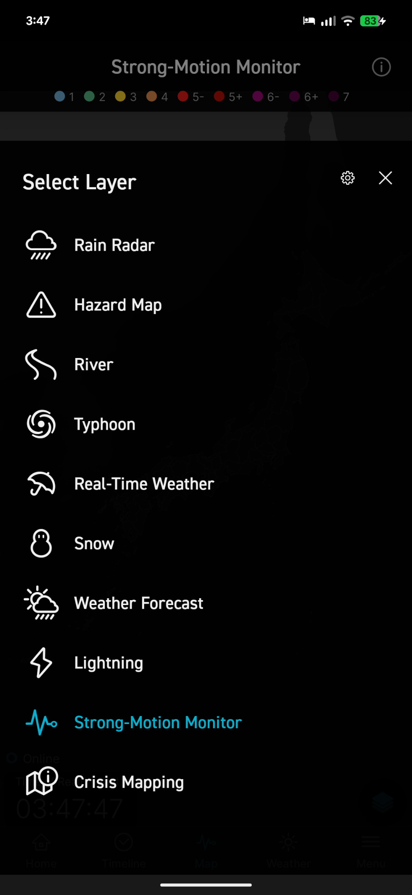
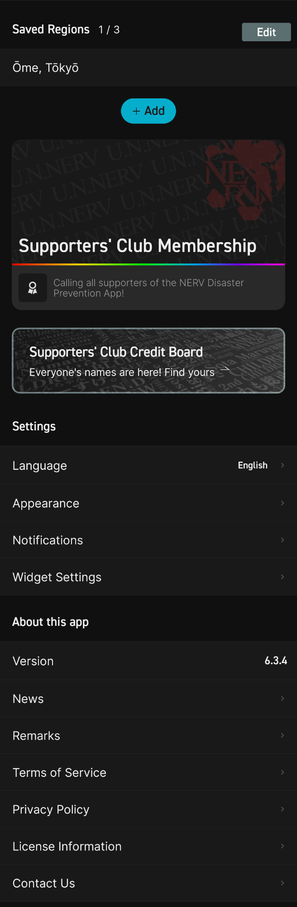

# Citizen Report — Product Requirements

Living document of requirements so nothing is lost between iterations. Status
tags: **DONE**, **IN PROGRESS**, **PLANNED**.

Product: a civic nuisance reporting platform for Japan. Residents install a mobile
app, report local issues (with location and optional photo), and a backend
correlates related reports and alerts local police via social media (X).

---

## Phase 1 — Foundation — **DONE**

### Mobile app (Expo / React Native, iOS + Android)
- Requests location permission on launch; submitting requires a location.
- Report button + selection of issue types:
  `illegal_garbage_dumping`, `noise_nuisance`, `biker_gang`, `accident`,
  `illegal_barbecue`, `bear_sighting`.
- Optional photo (camera or library).
- Authenticated submission (bearer token + per-install device id).
- Silently discards duplicate reports from the same device at the same location
  (client-side, backed by server-side dedupe).

### Backend service (clean architecture — ports & adapters)
- `POST /api/v1/reports` (auth), `GET /api/v1/issue-types`, `GET /health`.
- Persistence port with **RDS/Postgres** (default) and **DynamoDB** adapters;
  switching backends is a composition-root change only.
- Image storage (S3), social poster (X), map renderer, police directory, and
  authenticator are all ports with safe fakes by default.
- Correlation:
  - **Biker gang (movement):** correlate a new sighting with earlier ones within
    a search radius (10–20 km) only when the observation times are consistent
    with a single group physically travelling between the two points. On a match,
    render a route map and post to X tagging local police.
  - **Garbage dumping / other stationary types (colocation):** 2+ same-type
    reports at the same location are correlated and posted to X.
  - **Duplicates:** same device + type + location within a window are discarded.
- Japan-first configuration (units, timezone, prefectural police handles).

---

## Phase 2 — App shell & core screens — **DONE**

1. **Bottom tab bar** with four tabs: **Report**, **History**, **Dashboard**,
   **Settings**. The selected tab's icon + label are highlighted.
   > The 4th tab was originally **Donate**; per Phase 2.2 it becomes **Settings**
   > and donations move inside it.
2. **Fast report flow (two steps):**
   - Step 1: a list of report types — one tap selects and advances.
   - Step 2: a details page with an **optional photo preview in the top half** and
     an **optional text box in the bottom half**.
   - **Submit** button is **full-width, red, positioned just above the bottom
     tab bar**.
3. **Report history:** locally cached list of the device's reports; each entry
   links to the social media post if one was created for that report.
4. **Dashboard v1:** aggregates reports by type for **all time, month, week, day**.
   > Superseded by the **Map Dashboard** in Phase 2.1 below.

---

## Phase 2.1 — Map Dashboard — **PLANNED** (new)

Redesign the Dashboard into a map-first view styled after the attached mockups
(a weather-app style). Reference mockups (in `docs/mockups/`):

- `dashboard_national_map.png` — National scope: dark map with data overlay,
  scope tabs, info card. 
- `dashboard_local_map.png` — Local scope: zoomed to the user's area with the
  jurisdiction boundary highlighted and a summary card.
  
- `dashboard_map_layer_view.png` — Map with a selected layer, a legend/scale row
  under the title, a floating layers button (bottom-right), and a status/clock.
  
- `dashboard_layer_selector.png` — The **"Select Layer"** bottom sheet that
  **expands from the bottom**, listing layers with icons; the active layer is
  highlighted. 

### Requirements

1. **Map-first dashboard**: full-screen dark map (Japan) that plots reports as
   markers/overlay, replacing the current list-style dashboard.
2. **Scope tabs** at the top: **National** / **Local** / **[saved region]**
   (Local/region zooms to a saved region and highlights its jurisdiction, per
   `dashboard_local_map.png`). The selectable regions come from the user's
   **Saved Regions** (up to 3 — see Settings, Phase 2.2).
3. **Layer selector to choose report type**:
   - A floating **layers button** (bottom-right) opens an **expanding "Select
     Layer" bottom sheet** (per `dashboard_layer_selector.png`).
   - The sheet lists the report types as layers (each with an icon); selecting
     one filters the map to that report type. The **active layer is highlighted**.
   - Include an "All types" option in addition to the six individual types.
   - (This is the "layer dropdown to select report type".)
4. **Legend row** under the layer title showing a **color per report type**
   (a marker/type legend). **Not** an earthquake-magnitude scale — the mockups
   are from another app and that legend is only a layout reference, not a
   requirement. Severity may optionally be encoded (e.g. marker size/opacity).
5. **Bottom info card** summarizing the current scope/layer (e.g. counts,
   most recent report), per the mockups.
6. **Data rule — biker gang de-duplication of correlations:** when displaying or
   counting **biker gang** reports on the dashboard/map, **use only the first
   (originating) report of each correlated group and ignore the correlated
   follow-on sightings.** A single moving gang must appear as one origin point /
   be counted once, not once per correlated sighting. (Other report types are
   unaffected.)

### Decisions (confirmed) & open questions

Confirmed:
- **Platform:** **mobile app only** for regular users. The map dashboard is a
  mobile screen. There is **no user-facing web UI**; the existing `server/` +
  `client/` web view is not part of the product and may be repurposed for the
  future Web Admin & Power-User Portal (see Future Phases). Do **not** delete it
  yet.
- **Legend:** color per **report type**; no earthquake-magnitude scale.
- **Regions:** the Local/region scope uses the user's **Saved Regions (up to 3)**
  managed in Settings.

Open questions:
- **Map provider:** Expo/React Native needs a map. Options: `react-native-maps`
  (Google/Apple tiles; limited on Expo web) or a WebView/MapLibre approach.
  Proposed: `react-native-maps` for native + a graceful fallback on web.
  Confirm preference, and whether an API key/tiles provider is available.
- **Data source:** the dashboard currently reads **local history** only. A map of
  reports across a region implies a **backend read API** (e.g.
  `GET /api/v1/reports?issueType=...&bbox=...`), which does not exist yet.
  Confirm whether the map shows (a) only this device's reports, or (b) all
  reports from the service (requires a new list endpoint).
- **"First report" for biker gang:** confirm the correlation grouping is computed
  server-side (the service knows the correlated `matchedReportIds`) and exposed
  so the client can collapse a group to its origin; otherwise define the client
  rule.

---

## Phase 2.2 — Settings tab (replaces Donate) — **PLANNED** (new)

The 4th bottom tab becomes **Settings**; donations move inside it. Layout/style
referenced from `docs/mockups/settings_screen.png` (only the structure is a
reference; branding/content is ours).

### Requirements

1. **Rename tab** Donate → **Settings** (with a settings/gear icon). Highlighted
   when selected, like the other tabs.
2. **Saved Regions (up to 3)** at the top of Settings:
   - Shows the list with a count (e.g. "Saved Regions 1 / 3") and Edit/remove.
   - **Add a region two ways:**
     - **GPS / current location** — register the region for where the user is now.
     - **Manual by region** — pick a region (e.g. prefecture / municipality).
   - Enforce a **maximum of 3** saved regions.
   - These saved regions populate the Dashboard's Local/region scope tabs
     (Phase 2.1) — the dashboard supports **up to 3 regions**.
3. **Donations** moved here as a section (the former Donate content: supporter
   message + tiers + donate action).
4. **App settings** (per mockup, keep what we need):
   - **Language** (English / 日本語) with the current value shown.
   - **Appearance** (theme).
   - **Notifications** (preferences; ties to Phase 3 local notifications).
   - **Widget Settings** (optional / later).
5. **About this app** section: **Version**, **News**, **Remarks**,
   **Terms of Service**, **Privacy Policy**, **License Information**,
   **Contact Us**.

### Open questions
- **Region granularity for manual selection:** prefecture only, or
  prefecture → municipality? (Affects the Local map zoom + boundary highlight.)
- Which About items are needed at launch vs. later (News/Remarks/Widgets)?

---

## Phase 3 — **PLANNED**

1. **AI image processing:** blur sensitive data (faces, license plates, etc.) in
   attached photos **before** posting to social media.
   - Implement behind a port (e.g. `ImageRedactor`) so the model/provider is
     swappable; runs in the backend processing pipeline before `SocialPoster`.
2. **Authentication / sign-in from the app:**
   - OAuth sign-in.
   - Password sign-in + password reset.
   - OTP sign-in / OTP reset.
   - Behind the existing `Authenticator` port; requires provider decision
     (e.g. AWS Cognito, Auth0, or custom) and secrets.
3. **Local notifications** to users about nearby reports **without being noisy**
   (rate-limited / batched / relevance-filtered; respect quiet hours).

---

## Future Phases (later)

### Web Admin & Power-User Portal — **PLANNED (later phase)**

Regular users are served **only by the mobile app**. A separate **web UI** is for
staff / power users, not the public:
- **Admin UI:** moderation, managing reports, configuring correlation thresholds,
  police-handle directory, and reviewing/curating social posts.
- **Power-user access with roles:**
  - **Journalists:** read/search access to (appropriate) report data and trends.
  - **Police:** access to reports/alerts relevant to their jurisdiction.
  - **Developers:** API keys / debugging / integration access.
- **Role-based access control** with authentication (see Phase 3 auth).
- The existing `server/` + `client/` web app may be **repurposed** as the basis
  for this portal rather than discarded.

---

## Change log
- Phase 1 and Phase 2 implemented.
- Phase 2.1 (Map Dashboard), Phase 2.2 (Settings tab), Phase 3, and the future
  Web Admin & Power-User Portal captured from requirements + mockups on
  2026-08-29.
- Refinements (2026-08-29): no user-facing web UI (app only); web is for a later
  admin/power-user portal; dashboard legend is by report type (no earthquake
  magnitude scale); Donate tab becomes Settings with donations nested; Settings
  adds Saved Regions (max 3, via GPS or manual) feeding the dashboard's up-to-3
  region scopes, plus Language and other app/About options.
